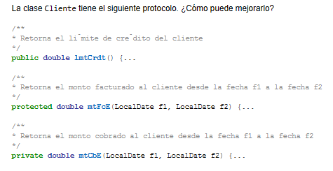
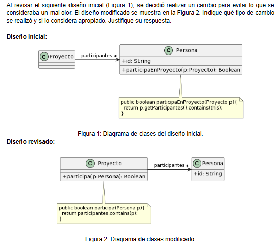
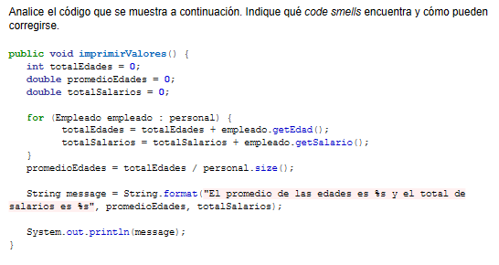

# Ejercicio 1: algo huele mal
___
## 1.1 Protocolo de cliente.

### Bad Smell: Comments (1, 2 y 3).
La falta de claridad en los nombres de métodos lleva a confusiones e incluso implementaciones incorrectas a la hora de escalar o usar el proyecto.
### Refactoring a aplicar: Rename Method.
1. 
    ```java
    public double getLimiteCredito() {}
    ```
2. ```java
    protected double getFacturacionEntreFechas(LocalDate f1, LocalDate f2) {}
    ```
3. ```java
   private double getCobradoEntreFechas(LocalDate f1, LocalDate f2) {}
    ```
La falta de claridad en los nombres de parámetros causa que el cuerpo del método sea más difícil de interpretar.
### Refactoring a aplicar: Rename Params.
2. ```java
   protected double getFacturacionEntreFechas(LocalDate fechaInicio, LocalDate fechaFinal) {}
   ```
3. ```java
   private double getCobradoEntreFechas(LocalDate fechaInicio, LocalDate fechaFinal) {}
   ```
___
## 1.2 Participación en proyectos.

### Bad Smell: Feature Envy.
La clase `Persona` no debería estar utilizando propiedades de la clase `Proyecto`, que es la verdadera responsable de evaluar si una `Persona` se encuentra en su colección de `participantes[*]`.
### Refactoring aplicado: Move Method.
El método `public boolean participaEnProyecto` es movido a la clase `Proyecto`.

Si bien el cambio lo considero apropiado, se presenta otro Bad Smell en la propuesta modificada.
### Bad Smell: Rompe encapsulamiento.
La variable de instancia `id` es `public`, lo que rompe el encapsulamiento.
### Refactoring a aplicar: Encapsulate Field.
Simplemente debe modificarse la declaración a `private String id;`
___
## 1.3 Cálculos

### Bad Smells: Long Method, For loop y Temporary Fields.
La aparición de un método largo es señal de un método que rompe con el principio de Single Responsibility. A su vez, se está reinventando la rueda al utilizar un loop for y variables locales existiendo enfoques funcionales ya implementados en el lenguaje: streams.
Propuesta: crear dos métodos privados que retornen el promedio de edad y el total de salarios. Luego llamarlos en `imprimirValores()`, logrando que cada método cumpla un solo cometido.
### Refactorings a aplicar: Extract Method (para cada cálculo), Replace For with Pipeline (para cada cálculo) y Replace Temp with Query (en println).
```java
private double calcularTotalSalarios(){
    return personal.stream()
            .mapToDouble(empleado -> empleado.getSalario())
            .sum();
}

private double calcularPromedioEdad(){
    return personal.stream()
            .mapToInt(empleado -> empleado.getEdad())
            .average()
            .orElse(0);
}

public void imprimirValores(){
    String message = String.format("El promedio de las edades es %s y el " +
            "total de salarios es %s", promedioEdades, totalSalarios);
    System.out.println(message);
}
```