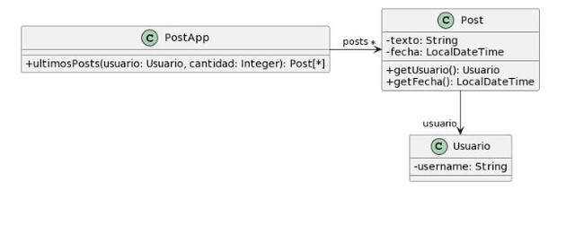

## 2.3 Publicaciones
___

### Código original:
```java
/**
* Retorna los últimos N posts que no pertenecen al usuario user
*/
public List<Post> ultimosPosts(Usuario user, int cantidad) {
        
    List<Post> postsOtrosUsuarios = new ArrayList<>();
    for (Post post : this.posts) {
        if (!post.getUsuario().equals(user)) {
            postsOtrosUsuarios.add(post);
        }
    }
        
   // ordena los posts por fecha
   for (int i = 0; i < postsOtrosUsuarios.size(); i++) {
       int masNuevo = i;
       for(int j= i +1; j < postsOtrosUsuarios.size(); j++) {
           if (postsOtrosUsuarios.get(j).getFecha().isAfter(
     postsOtrosUsuarios.get(masNuevo).getFecha())) {
              masNuevo = j;
           }    
       }
      Post unPost = postsOtrosUsuarios.set(i,postsOtrosUsuarios.get(masNuevo));
      postsOtrosUsuarios.set(masNuevo, unPost);    
   }
        
    List<Post> ultimosPosts = new ArrayList<>();
    int index = 0;
    Iterator<Post> postIterator = postsOtrosUsuarios.iterator();
    while (postIterator.hasNext() &&  index < cantidad) {
        ultimosPosts.add(postIterator.next());
    }
    return ultimosPosts;
}
```
### Bad Smell: *Long Method*.
El método es largo porque reinventa la rueda: utiliza distintos loops para iterar repetidamente sobre listas a las que se le aplican operaciones que en un Stream serían intermedias. 

Podría agregarse un paso donde se separan los métodos y luego se reúnen. Pero lo consideré innecesario: a simple vista uno reconoce el uso de Loops en lugar de Pipeline, las cuales cumplen múltiples propósitos, haciendo redundante e impráctico detenerse en ese refactor.
### Refactor a aplicar: *Replace Loop with Pipeline*.
```java
/**
* Retorna los últimos N posts que no pertenecen al usuario user
*/
public List<Post> ultimosPosts(Usuario user, int cantidad){
    return this.posts.stream()
            .filter(post -> !post.getUsuario.equals(user))
            .sorted(Comparator.comparing(Post::getFecha)
                    .reversed())
            .limit(cantidad)
            .toList();
}
```
### Bad Smell: *Comments*.
El nombre es poco explicativo. El comentario podría simplemente ser el nombre del método.
### Refactor a aplicar: *Rename Method*.
```java
public List<Post> ultimosNPostsExcluyendoLosDeUsuario(Usuario user, int cantidad){
    return this.posts.stream()
            .filter(post -> !post.getUsuario.equals(user))
            .sorted(Comparator.comparing(Post::getFecha)
                    .reversed())
            .limit(cantidad)
            .toList();
}
```
### Bad Smell: *Feature Envy*.
Al filtrar se utilizan atributos de la clase post de manera directa, cuando debería llamarse a un método de la clase.

Ya que la clase `Post` no corresponde al *scope* de este ejercicio el siguiente refactor no se aplicaría, pero dejo constancia de haber notado el Bad Smell y su solución.
### Refactor a aplicar: *Move Method*.
```java
public class Post{
    private Usuario user;
    private Date fecha;
    // getters y setters
    public noEsDe(Usuario user){
        return !this.user.equals(user);
    }
}

public List<Post> ultimosNPostsExcluyendoLosDeUsuario(Usuario user, int cantidad){
    return this.posts.stream()
            .filter(post -> post.noEsDe(user))
            .sorted(Comparator.comparing(Post::getFecha)
                    .reversed())
            .limit(cantidad)
            .toList();
}
```
___