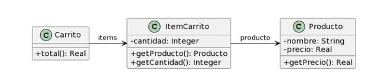

## 2.4 Carrito de compras
___

### Código original:
```java
public class Producto {
    private String nombre;
    private double precio;
    
    public double getPrecio() {
        return this.precio;
    }
}

public class ItemCarrito {
    private Producto producto;
    private int cantidad;
        
    public Producto getProducto() {
        return this.producto;
    }
    
    public int getCantidad() {
        return this.cantidad;
    }

}

public class Carrito {
    private List<ItemCarrito> items;
    
    public double total() {
        return this.items.stream()
            .mapToDouble(item -> 
                item.getProducto().getPrecio() * item.getCantidad())
            .sum();
    }
}
```
### Bad Smell: *Middleman*.
`ItemCarrito` no aporta ningún tipo de valor lógico. Un `ItemCarrito` tiene una relación "es un" con `Producto` y al tratarse de un carrito... ¿por qué tener clases que separan un producto cargado de uno que no?, ¿no sería el último irrelevante para este esquema?
### Refactor a aplicar: *Remove middleman*.
```java
public class Producto {
    private String nombre;
    private double precio;
    private int cantidad;
    
    public double getPrecio() {
        return this.precio;
    }
    
    public int getCantidad() {
        return this.cantidad;
    }
}

public class Carrito {
    private List<Producto> items;
    
    public double total() {
        return this.items.stream()
            .mapToDouble(item -> 
                item.getProducto().getPrecio() * item.getCantidad())
            .sum();
    }
}
```
### Bad Smell: *Feature Envy*.
La clase `Carrito` hace uso de un cálculo con los atributos de `Producto` en la operación intermedia `mapToDouble()`.
### Refactor a aplicar: *Move Method*.
```java
public class Producto {
    private String nombre;
    private double precio;
    private int cantidad;
    
    public double calcularTotal(){
        return this.precio * this.cantidad;
    }
}

public class Carrito {
    private List<Producto> items;
    
    public double total() {
        return this.items.stream()
            .mapToDouble(Producto::calcularTotal)
            .sum();
    }
}
```
### Bad Smell: nombres poco descriptivos?
La cátedra lo reclamaría para `total()`, pero no estoy de acuerdo.
### Refactor a aplicar: *Rename Method¨*.
```java
public class Producto {
    private String nombre;
    private double precio;
    private int cantidad;
    
    public double calcularTotal(){
        return this.precio * this.cantidad;
    }
}

public class Carrito {
    private List<Producto> items;
    
    public double calcularTotalDelCarrito() {
        return this.items.stream()
            .mapToDouble(Producto::calcularTotal)
            .sum();
    }
}
```