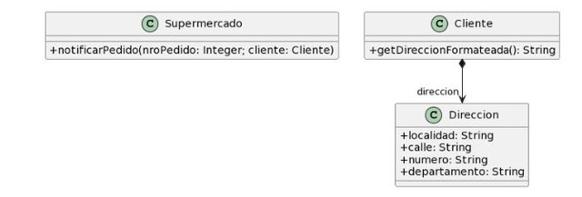

## 2.5 Envío de pedidos
___

### Código original:
```java
public class Supermercado {
    public void notificarPedido(long nroPedido, Cliente cliente) {
    String notificacion = MessageFormat.format("Estimado cliente, se le informa
            + "que hemos recibido su pedido con número {0}, el cual será enviado a la dirección"
            + "{1}, new Object[] { nroPedido, cliente.getDireccionFormateada() }");
    // lo imprimimos en pantalla, podría ser un mail, SMS, etc..
    System.out.println(notificacion);
    }
}

public class Cliente {
    //En el código original debería ya existir escrita "private Direccion direccion"
    //pero la ocultaron para ver si nos dábamos cuenta.
    public String getDireccionFormateada() {
        return
                this.direccion.getLocalidad() + ", " +
                        this.direccion.getCalle() + ", " +
                        this.direccion.getNumero() + ", " +
                        this.direccion.getDepartamento();
    }
}
```
### Bad Smell: *Feature Envy*.
Se están utilizando directamente los campos de la variable de instancia `this.direccion`, a la vez que reinventando la rueda, en lugar de llamar al método predefinido `toString()`.
### Refactor a aplicar: *Move method*.
```java
public class Supermercado {
    
    public void notificarPedido(long nroPedido, Cliente cliente) {
    String notificacion = MessageFormat.format("Estimado cliente, se le informa
            + "que hemos recibido su pedido con número {0}, el cual será enviado a la dirección"
            + "{1}, new Object[] { nroPedido, cliente.getDireccionFormateada() }");
    // lo imprimimos en pantalla, podría ser un mail, SMS, etc.
    System.out.println(notificacion);
    }
}

public class Cliente {
    private Direccion direccion;
    
    public String getDireccionFormateada() {
        return this.direccion.toString();
    }
}

public class Direccion{
    private String localidad;
    private String calle;
    private int numero;
    private String departamento;
    //Se usaron getters y setters en el código original: asumo que existía encapsulamiento.
    public String toString(){
        return
                this.direccion.getLocalidad() + ", " +
                        this.direccion.getCalle() + ", " +
                        this.direccion.getNumero() + ", " +
                        this.direccion.getDepartamento();
    }
}
```
### Bad Smell: *Middle man*.
La clase `Cliente` no aporta valor lógico y solo funciona como intermediario entre `Direccion` y `Supermercado`.
### Refactor a aplicar: *Remove middle man*.
```java
public class Supermercado {
    
    public void notificarPedido(long nroPedido, Direccion direccion) {
    String notificacion = MessageFormat.format("Estimado cliente, se le informa
            + "que hemos recibido su pedido con número {0}, el cual será enviado a la dirección"
            + "{1}, new Object[] { nroPedido, direccion}");
    // lo imprimimos en pantalla, podría ser un mail, SMS, etc.
    System.out.println(notificacion);
    }
}

public class Direccion{
    private String localidad;
    private String calle;
    private int numero;
    private String departamento;
    //Se usaron getters y setters en el código original: asumo que existía encapsulamiento.
    public String toString(){
        return
                this.direccion.getLocalidad() + ", " +
                        this.direccion.getCalle() + ", " +
                        this.direccion.getNumero() + ", " +
                        this.direccion.getDepartamento();
    }
}
```
___