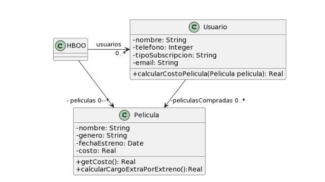

## 2.6 Películas
___

### Código original:
```java
public class Usuario {
    String tipoSubscripcion;
    // ...

    public void setTipoSubscripcion(String unTipo) {
   	 this.tipoSubscripcion = unTipo;
    }
    
    public double calcularCostoPelicula(Pelicula pelicula) {
   	 double costo = 0;
   	 if (tipoSubscripcion=="Basico") {
   		 costo = pelicula.getCosto() + pelicula.calcularCargoExtraPorEstreno();
   	 }
   	 else if (tipoSubscripcion== "Familia") {
   		 costo = (pelicula.getCosto() + pelicula.calcularCargoExtraPorEstreno()) * 0.90;
   	 }
   	 else if (tipoSubscripcion=="Plus") {
   		 costo = pelicula.getCosto();
   	 }
   	 else if (tipoSubscripcion=="Premium") {
   		 costo = pelicula.getCosto() * 0.75;
   	 }
   	 return costo;
    }
}

public class Pelicula {
    LocalDate fechaEstreno;
    // ...

    public double getCosto() {
   	 return this.costo;
    }
    
    public double calcularCargoExtraPorEstreno(){
   	    return (ChronoUnit.DAYS.between(this.fechaEstreno, LocalDate.now()) ) > 30 ? 0 : 300;
    }
}
```
### Bad Smell: *Comments*.
El comentario del método `calcularCargoExtraPorEstreno()` es innecesario porque el código es tan autoexplicativo como puede ser.
### Refactor a aplicar: *Remove comments*.
### Bad Smell: *Switch Statement*.
Se consulta por el parámetro pasado como String cuando podría utilizarse polimorfismo por medio de una interfaz para definir una familia de Suscripciones.

Además, se utiliza el operador `==` en lugar del método `equals()`, por lo que el resultado no será el que se intuye como esperado por cómo se expresa el código: se compararán referencias en lugar del contenido del String.
### Refactor a aplicar: *Replace Conditional with Polymorphism*.
```java
public class Usuario {
    private Suscripcion suscripcion;
// ...

    public void setSuscripcion(Suscripcion suscripcion) {
        this.subscripcion = suscripcion;
    }
    
    public double calcularCostoPelicula(Pelicula pelicula) {
        return this.suscripcion.calcularCostoPelicula(pelicula);
    }
}

public interface Suscripcion{
    double calcularCostoPelicula(Pelicula pelicula);
}

public class SuscripcionBasica implements Suscripcion{
    @Override
    public double calcularCostoPelicula(Pelicula pelicula){
        return pelicula.getCosto() + pelicula.calcularCargoExtraPorEstreno();
    }
}

public class SuscripcionFamilia implements Suscripcion{
    @Override
    public double calcularCostoPelicula(Pelicula pelicula){
        return (pelicula.getCosto() + pelicula.calcularCargoExtraPorEstreno()) * 0.90;
    }
}

public class SuscripcionPlus implements Suscripcion{
    @Override
    public double calcularCostoPelicula(Pelicula pelicula){
        return pelicula.getCosto();
    }
}

public class SuscripcionPremium implements Suscripcion{
    @Override
    public double calcularCostoPelicula(Pelicula pelicula){
        return pelicula.getCosto() * 0.75;
    }
}

public class Pelicula {
    private LocalDate fechaEstreno;
// ...

    public double getCosto() {
   	 return this.costo;
    }
    
    public double calcularCargoExtraPorEstreno(){
   	    return (ChronoUnit.DAYS.between(this.fechaEstreno, LocalDate.now()) ) > 30 ? 0 : 300;
    }
}
```
### Bad Smell: *Feature Envy*.
Las clases `SuscripcionBasica` y `SuscripcionFamilia` utilizan código duplicado que requiere atributos de la clase `Pelicula`.
### Refactor a aplicar: *Move method*.
```java
public class Usuario {
    private Suscripcion suscripcion;
// ...

    public void setSuscripcion(Suscripcion suscripcion) {
        this.subscripcion = suscripcion;
    }
    
    public double calcularCostoPelicula(Pelicula pelicula) {
        return this.suscripcion.calcularCostoPelicula(pelicula);
    }
}

public interface Suscripcion{
    double calcularCostoPelicula(Pelicula pelicula);
}

public class SuscripcionBasica implements Suscripcion{
    @Override
    public double calcularCostoPelicula(Pelicula pelicula){
        return pelicula.calcularCostoConCargoExtra();
    }
}

public class SuscripcionFamilia implements Suscripcion{
    @Override
    public double calcularCostoPelicula(Pelicula pelicula){
        return pelicula.calcularCostoConCargoExtra() * 0.90;
    }
}

public class SuscripcionPlus implements Suscripcion{
    @Override
    public double calcularCostoPelicula(Pelicula pelicula){
        return pelicula.getCosto();
    }
}

public class SuscripcionPremium implements Suscripcion{
    @Override
    public double calcularCostoPelicula(Pelicula pelicula){
        return pelicula.getCosto() * 0.75;
    }
}

public class Pelicula {
    private LocalDate fechaEstreno;
// ...

    public double getCosto() {
   	 return this.costo;
    }
    
    private double calcularCargoExtraPorEstreno(){
   	    return (ChronoUnit.DAYS.between(this.fechaEstreno, LocalDate.now()) ) > 30 ? 0 : 300;
    }
    
    public double calcularCostoConCargoExtra(){
        return this.costo + calcularCargoExtraPorEstreno();
    }
}
```
___