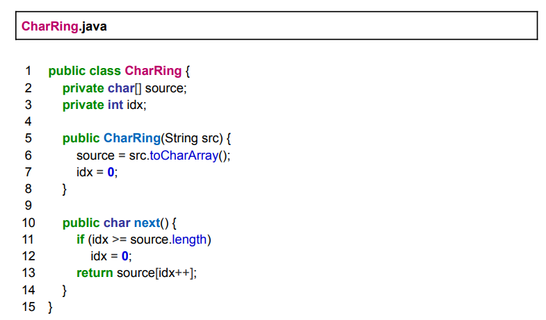
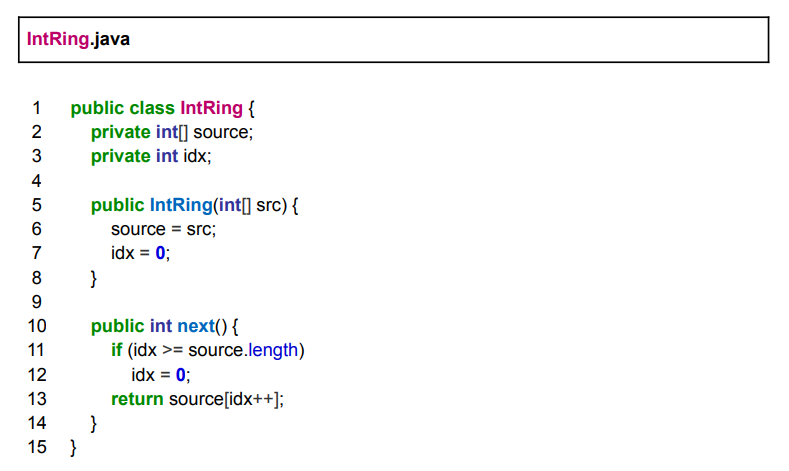
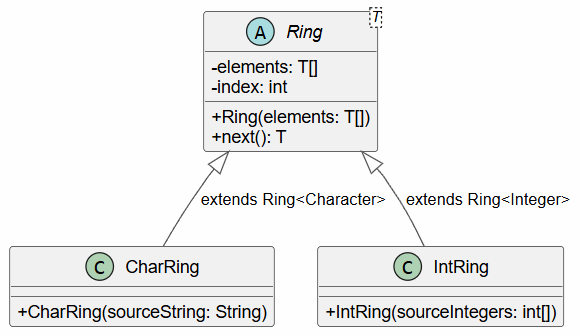

## Ejercicio 3: Iteradores circulares bis

### Nota: este ejercicio se podía resolver usando Collections como ArrayList<>, pero decidí intentar lograr una solución manteniendo el uso de primitivos ya que de otra forma la solución sería muy obvia.

---



Tareas:
1) Diseñe e implemente Test de Unidad para las clases CharRing e IntRing. Asegúrese
   de que los test pasen.
2) Aplique el refactoring Extract Superclass. Detalle cada uno de los pasos
   intermedios que son necesarios para poder aplicar correctamente este refactoring.
3) Verifique que los tests definidos en el paso 1 sigan funcionando correctamente.
4) Realice un diagrama de clases UML con el diseño refactorizado.

1.
```java
class CharRingTest{
    private CharRing charRing;
    
    @Test
    public void nextHappyPathTest(){
        charRing = new CharRing("ABC");
        assertEquals("A", charRing.next());
        assertEquals("B", charRing.next());
        assertEquals("C", charRing.next());
        assertEquals("A", charRing.next());
    }
    
    @Test
    public void nextEmptyStringTest(){
        charRing = new CharRing("");
        assertThrows(IndexOutOfBoundsException.class, () -> charRing.next());
    }
    
    @Test
    public void nextSingleCharStringTest(){
        charRing = new CharRing("M");
        assertEquals("M", charRing.next());
        assertEquals("M", charRing.next());
        assertEquals("M", charRing.next());
    }
}

class IntRingTest{
    private IntRing intRing;
    
    @Test
    public void nextHappyPathTest(){
        int[] numbers = {1, 2, 3};
        intRing = new IntRing(numbers);
        assertEquals(1, intRing.next());
        assertEquals(2, intRing.next());
        assertEquals(3, intRing.next());
        assertEquals(1, intRing.next());
    }
    
    @Test
    public void nextEmptyArrayTest(){
        int[] emptyArray = {};
        intRing = new IntRing(emptyArray);
        assertThrows(IndexOutOfBoundsException.class, () -> intRing.next());
    }
    
    @Test
    public void nextSingleNumberArray(){
        int[] singleItemArray = {1};
        intRing = new IntRing(singleItemArray);
        assertEquals(1, intRing.next());
        assertEquals(1, intRing.next());
        assertEquals(1, intRing.next());
    }
}
```

2. 
Para aplicar _Extract Superclass_ se debe primero crear una superclase que represente y abarque el comportamiento compartido entre ambas clases. Debe ser abstracta ya que solo definirá comportamiento y no será un tipo que queramos instanciar de forma individual. Además, de esta forma, podemos agruparlas en Collections para manipular todos los "Ring". Usará un Generic Type "T" ya que servirá para que acepte cualquier tipo de Object. La intención es aprovechar el boxing y unboxing de los primitivos y sus wrappers para evitar la duplicación de código.
```java
public abstract class Ring<T>{}
```
Ahora debe hacerse _Pull Up Fields_ a todos los campos. Ya no tendremos un Array de char o de int, si no uno de <T>.
```java
public abstract class Ring<T>{
    private T[] source;
    private int idx;
}
```
Aplicaré _Rename Field_ a ambos campos para mejorar la claridad. Si bien podría usar "i" para el index, preservaré la intención inicial de buscar claridad llamándole "index".
```java
public abstract class Ring<T>{
    private T[] elements;
    private int index;
}
```
Hago _Pull Up Constructor Body_ ya que los campos de la instancia se encontrarán en la clase genérica y no en las concretas.
```java
public abstract class Ring<T>{
    private T[] elements;
    private int index;
    
    public Ring(T[] elements){
        this.elements = elements;
        this.index = 0;
    }
}
```
También _Pull Up Method_ para `next()`.
```java
public abstract class Ring<T>{
    private T[] elements;
    private int index;
    
    public Ring(T[] elements){
        this.elements = elements;
        this.index = 0;
    }
    
    public int next(){
        if (index >= elements.lenght) index = 0;
        return elements[index++];
    }
}
```
Lo único que queda por hacer es implementar el comportamiento único de cada Object que queramos que acepte nuestro Ring<T>...
```java
public abstract class Ring<T>{
    private T[] elements;
    private int index;
    
    public Ring(T[] elements){
        this.elements = elements;
        this.index = 0;
    }
    
    public int next(){
        if (index >= elements.lenght) index = 0;
        return elements[index++];
    }
}

public class CharRing extends Ring<Character>{
    public CharRing(String sourceString){
        super(sourceString.chars
                .mapToObj(c -> (char) c)
                .toArray(Character[]::new));
    }
}

public class IntRing extends Ring<Integer>{
    public IntRing(int[] sourceIntegers){
        super(Arrays.toStream(sourceIntegers)
                .boxed
                .toArray(Integer[]::new));
    }
}
```
3. 
Los tests no pasarían porque podría fallar al comparar si no se usa explícitamente un boxing de los valores con `Integer.valueOf()` o `Character.valueOf()`. Pero más allá de eso, es el único cambio a realizar.
4. 
