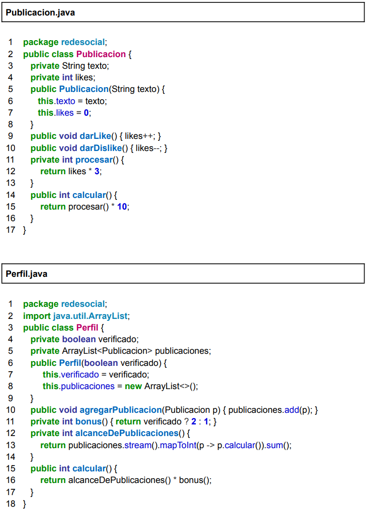

## Ejercicio 4: Alcance en Redes Sociales

---
Una nueva red social está desarrollando un sistema para modelar perfiles y publicaciones, y
medir su alcance como parte del algoritmo de relevancia. Cada publicación acumula
reacciones de los usuarios, y cada perfil consolida el alcance de sus publicaciones
amplificándolo según si está verificado o no. El código es el siguiente:



Liste cada uno de los cambios necesarios, indicando archivo y línea afectados, para cada
uno de los siguientes refactorings:
1. Rename method: procesar (referenciado en línea 11 de Publicacion.java) por
   impacto.
2. Rename method: calcular (referenciado en línea 14 de Publicacion.java) por
   alcance.
3. Rename method: calcular (referenciado en línea 15 de Perfil.java) por alcance.
4. Rename parameter: el parámetro “p” del método agregarPublicacion (línea 10 de
   Perfil.java) por “publicacion”.

   
1.
```java
package redesocial;
public class Publicacion {
    private String texto;
    private int likes;
    public Publicacion(String texto) {
        this.texto = texto;
        this.likes = 0;
    }
    public void darLike() { likes++; }
    public void darDislike() { likes--; }
    private int impacto() {
        return likes * 3;
    }
    public int calcular() {
        return impacto() * 10;
    }
}

package redesocial;
import java.util.ArrayList;
public class Perfil {
    private boolean verificado;
    private ArrayList<Publicacion> publicaciones;
    public Perfil(boolean verificado) {
        this.verificado = verificado;
        this.publicaciones = new ArrayList<>();
    }
    public void agregarPublicacion(Publicacion p) { publicaciones.add(p); }
    private int bonus() { return verificado ? 2 : 1; }
    private int alcanceDePublicaciones() {
        return publicaciones.stream().mapToInt(p -> p.calcular()).sum();
    }
    public int calcular() {
        return alcanceDePublicaciones() * bonus();
    }
}
```
Afectadas: líneas 11 y 15 de Publicacion.java por referencia al método.

2.
```java
package redesocial;
public class Publicacion {
    private String texto;
    private int likes;
    public Publicacion(String texto) {
        this.texto = texto;
        this.likes = 0;
    }
    public void darLike() { likes++; }
    public void darDislike() { likes--; }
    private int impacto() {
        return likes * 3;
    }
    public int alcance() {
        return impacto() * 10;
    }
}

package redesocial;
import java.util.ArrayList;
public class Perfil {
    private boolean verificado;
    private ArrayList<Publicacion> publicaciones;
    public Perfil(boolean verificado) {
        this.verificado = verificado;
        this.publicaciones = new ArrayList<>();
    }
    public void agregarPublicacion(Publicacion p) { publicaciones.add(p); }
    private int bonus() { return verificado ? 2 : 1; }
    private int alcanceDePublicaciones() {
        return publicaciones.stream().mapToInt(p -> p.alcance()).sum();
    }
    public int calcular() {
        return alcanceDePublicaciones() * bonus();
    }
}
```
Afectadas: lineas 14 de Publicacion.java y 13 de Perfil.java por referencia.

3. 
```java
package redesocial;
public class Publicacion {
    private String texto;
    private int likes;
    public Publicacion(String texto) {
        this.texto = texto;
        this.likes = 0;
    }
    public void darLike() { likes++; }
    public void darDislike() { likes--; }
    private int impacto() {
        return likes * 3;
    }
    public int alcance() {
        return impacto() * 10;
    }
}

package redesocial;
import java.util.ArrayList;
public class Perfil {
    private boolean verificado;
    private ArrayList<Publicacion> publicaciones;
    public Perfil(boolean verificado) {
        this.verificado = verificado;
        this.publicaciones = new ArrayList<>();
    }
    public void agregarPublicacion(Publicacion p) { publicaciones.add(p); }
    private int bonus() { return verificado ? 2 : 1; }
    private int alcanceDePublicaciones() {
        return publicaciones.stream().mapToInt(p -> p.alcance()).sum();
    }
    public int alcance() {
        return alcanceDePublicaciones() * bonus();
    }
}
```
Afectada la línea 15 de Perfil.java.

4. 
```java
package redesocial;
public class Publicacion {
    private String texto;
    private int likes;
    public Publicacion(String texto) {
        this.texto = texto;
        this.likes = 0;
    }
    public void darLike() { likes++; }
    public void darDislike() { likes--; }
    private int impacto() {
        return likes * 3;
    }
    public int alcance() {
        return impacto() * 10;
    }
}

package redesocial;
import java.util.ArrayList;
public class Perfil {
    private boolean verificado;
    private ArrayList<Publicacion> publicaciones;
    public Perfil(boolean verificado) {
        this.verificado = verificado;
        this.publicaciones = new ArrayList<>();
    }
    public void agregarPublicacion(Publicacion publicacion) { publicaciones.add(publicacion); }
    private int bonus() { return verificado ? 2 : 1; }
    private int alcanceDePublicaciones() {
        return publicaciones.stream().mapToInt(p -> p.alcance()).sum();
    }
    public int alcance() {
        return alcanceDePublicaciones() * bonus();
    }
}
```
Afectada la línea 10 del archivo Perfil.java. Además se ve afectado el uso del parámetro en el cuerpo del método.