## Ejercicio 5: Productos

---
Se cuenta con un sistema que maneja una jerarquía de productos que pueden ser estadías
de hoteles o alquileres de autos. En el siguiente material adicional puede descargar un
proyecto con las clases implementadas. Observe que el proyecto cuenta con test unitarios
que verifican el funcionamiento correcto de la aplicación. A continuación se muestra un
extracto del código:

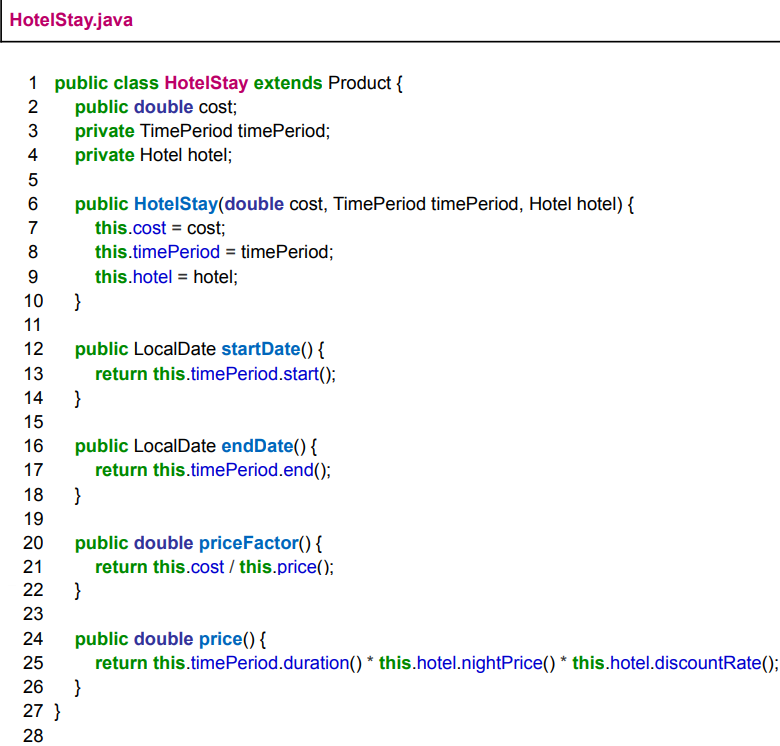
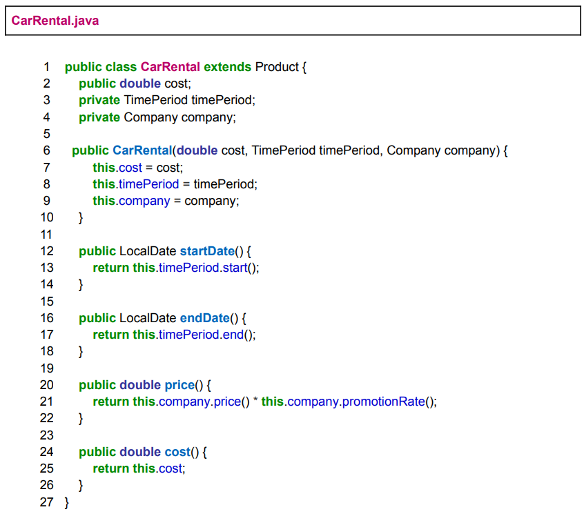

1. La variable “cost” está declarada como pública, lo que rompe el encapsulamiento de
   la clase. Utilice el refactoring Encapsulate Field y describa brevemente los pasos
   llevados a cabo. Verifique que los tests provistos sigan funcionando. Discuta con un
   ayudante: ¿Es correcto modificar alguno de los tests para que el código refactorizado
   funcione? En caso de qué el test falle, ¿qué situación está representando este test?
2. Utilice el refactoring Rename Field en el método priceFactor(), para que la variable
   “cost” se pase a llamar “quote”. Verifique que los tests provistos sigan funcionando.
   Discuta con un ayudante: ¿en este caso, es necesario modificar alguno de los tests
   para que el código refactorizado funcione?
3. Se quiere aplicar el refactoring Pull Up Method para subir los métodos startDate() y
   endDate() a la superclase Product. ¿Es posible hacerlo en el código anterior?
   Justifique su respuesta basándose en las precondiciones del refactoring vistas en la
   teoría y en el libro de Refactoring de Martin Fowler.
4. Mencione y aplique los refactorings necesarios para poder hacer Pull Up Method.
5. Aplique Pull Up Method para subir los métodos a la superclase Product. Verifique
   que los tests provistos sigan funcionando.
6. Observe los métodos price() en CarRental.java (línea 21) y en HotelStay.java (línea
   25). Identifique los Code Smell presentes. Luego aplique los refactoring
   correspondientes para eliminarlos. Verifique que los tests provistos sigan
   funcionando.

1. Al hacer _private_ el modificador de acceso del field, aquellos intentos de acceso al campo por medio de referencias directas, y no por getters, comenzarán a fallar.

    No tengo un ayudante con el que discutir. Pero dado que el test favorece una mala práctica, podemos afirmar que está mal diseñado. El mismo debería fallar (más bien no compilar) por no encontrar un getter de ese campo, no hacer un _workaround_ que ignore los principios de la Programación Orientada a Objetos.

    Este test está representando una situación donde no se practica el TDD (Test Driven Development). Primero se definió la implementación y luego, por desconocimiento o deshonestidad, se diseñaron tests que pasaran con el código proporcionado. No al revés, es decir, como debiera ser: un test que no pase si el código no está bien hecho.

    Un test como el descrito, al fallar, está promoviendo malas prácticas.
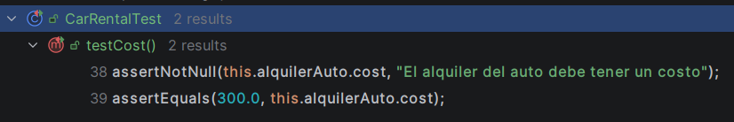

    El modificado debería verse así e incluir los cambios adjuntos:
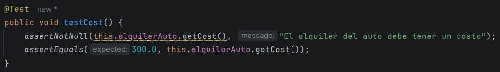
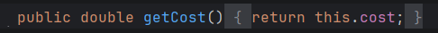
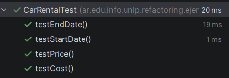
2. No. No es necesario para que funcione, pero sí es altamente recomendable para mantener la coherencia, mejorando la legibilidad.
3. Sí. Es posible hacer dicho refactor, ya que tienen fields que representan lo mismo, se llamen o no igual, y los cuerpos y signatures de los métodos a los que hacer _Pull Up_ son exactamente iguales.
4. Los refactorings necesarios son _Pull Up Field_ para el objeto TimePeriod y finalmente _Pull Up Method_ para los dos requeridos:
5. Capturas adjuntas:
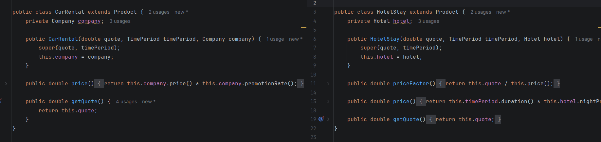
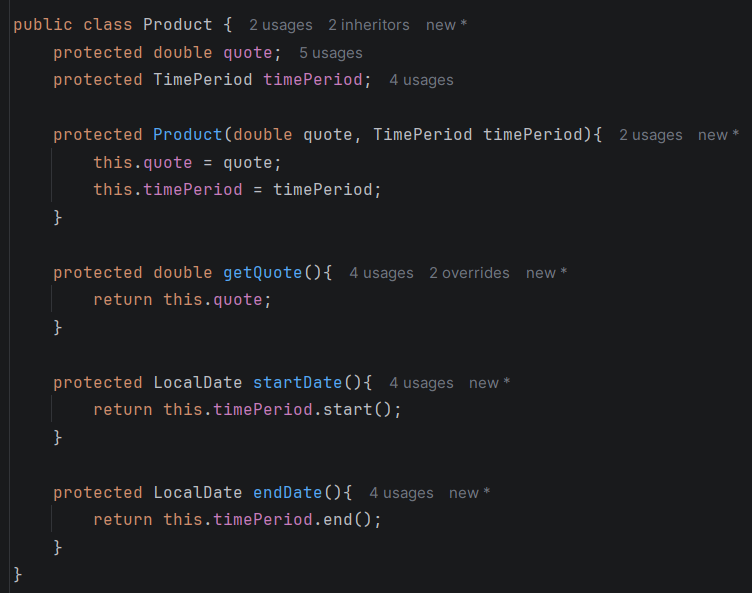
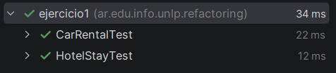
6. Se presenta una situación de _Alternative Classes with Different Interfaces_, dado que ambas representan una entidad comercial, que ofrece un servicio valorado a lo largo del tiempo, con un campo de descuento al precio total y un campo de unidad de precio. La diferencia entre Hotel y Company es semántica pero no funcional, y aquello funcionalmente diferente se encuentra situado en la clase HotelStay por medio de Feature Envy, decantando en el Code Smell que inicialmente se identifica. El primero termina siendo un side-effect una vez se analiza a mayor profundidad el código.

    Las clases Company y Hotel deben mantenerse. Es el Feature Envy aquel que hace parecer su diferenciación innecesaria.

    Primero refactorizaré con _Rename Method_ a `price()` de Company por `calculatePrice()`. A su vez eliminaré los getters innecesarios, ya que solo están ahí para promover el _Feature Envy_.
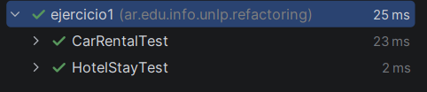
    Hecho eso y con los tests pasando, se destapa que el primer Code Smell era cierto. Ambas clases hacen exactamente lo mismo. Una de ellas es totalmente prescindible y normalizar los campos y dejar una sola con un nombre más claro es mejor. La diferenciación la dará el Producto contratado en el cálculo de su precio. Por lo que añadiré un método abstracto para que lo sobreescriban.

    Refactorizado, se debe hacer _Pull Up Field_ para generalizar en una superclase el campo repetido de Company.

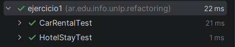
