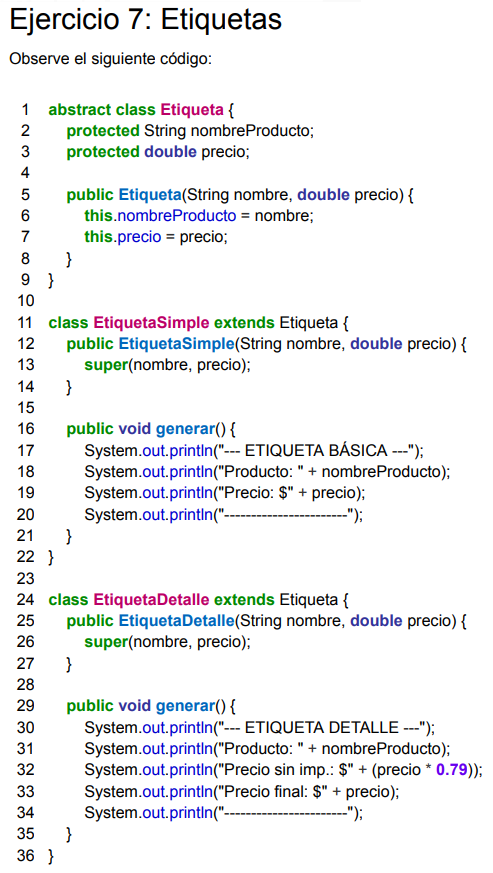

## Ejercicio 7: Etiquetas

---
1. ¿Hay código duplicado? Indique claramente en qué líneas se encuentra.
2. Se quiere aplicar el refactoring Pull Up Method para subir el método generar() a la
   superclase Etiqueta. ¿Es posible hacerlo en el código anterior? Justifique su
   respuesta basándose en las precondiciones del refactoring vistas en la teoría y en
   el libro de Refactoring de Martin Fowler.



1. 
```java
abstract class Etiqueta {
    protected String nombreProducto;
    protected double precio;
    
    public Etiqueta(String nombre, double precio) {
        this.nombreProducto = nombre;
        this.precio = precio;
    }
}

//==========================================================================

class EtiquetaSimple extends Etiqueta {
    public EtiquetaSimple(String nombre, double precio) {
        super(nombre, precio);
    }
    public void generar() {
        System.out.println("--- ETIQUETA BÁSICA ---"); // <-- Conceptualmente repetido
        System.out.println("Producto: " + nombreProducto); // <-- Literalmente repetido
        System.out.println("Precio: $" + precio); // <-- Conceptualmente repetido
        System.out.println("-----------------------"); // <-- Literalmente repetido
    }
}

//==========================================================================

class EtiquetaDetalle extends Etiqueta {     
    public EtiquetaDetalle(String nombre, double precio) {
        super(nombre, precio);
    }
    
    public void generar() {
        System.out.println("--- ETIQUETA DETALLE ---"); // <-- Conceptualmente repetido
        System.out.println("Producto: " + nombreProducto); // <-- Literalmente repetido
        System.out.println("Precio sin imp.: $" + (precio * 0.79));
        System.out.println("Precio final: $" + precio); // <-- Conceptualmente repetido
        System.out.println("-----------------------"); // <-- Literalmente repetido
    }
}

//==========================================================================
```
Además del código repetido no puedo evitar que me llame la atención que no se use `toString()`. Su uso conlleva ventajas implementadas en el lenguaje y es más fácil de leer, ya que uno espera que el output de todos los datos formateados de un objeto esté en el susodicho.

No indico las líneas porque dale... Pero háganlo en el parcial.

2. No podría aplicarse tal cual está porque los cuerpos de los métodos no son exactamente iguales. Para poder dejarlos lo suficientemente similares, debería primero refactorizar aspectos más pequeños.

    La línea `System.out.println("Precio sin imp.: $" + (precio * 0.79));` es única de `EtiquetaDetalle`. Aplico _Extract Method_.

```java
abstract class Etiqueta {
    protected String nombreProducto;
    protected double precio;
    
    public Etiqueta(String nombre, double precio) {
        this.nombreProducto = nombre;
        this.precio = precio;
    }
}

//==========================================================================

class EtiquetaSimple extends Etiqueta {
    public EtiquetaSimple(String nombre, double precio) {
        super(nombre, precio);
    }
    public void generar() {
        System.out.println("--- ETIQUETA BÁSICA ---"); // <-- Conceptualmente repetido
        System.out.println("Producto: " + nombreProducto); // <-- Literalmente repetido
        System.out.println("Precio: $" + precio); // <-- Conceptualmente repetido
        System.out.println("-----------------------"); // <-- Literalmente repetido
    }
}

//==========================================================================

class EtiquetaDetalle extends Etiqueta {     
    public EtiquetaDetalle(String nombre, double precio) {
        super(nombre, precio);
    }
    
    public void generar() {
        System.out.println("--- ETIQUETA DETALLE ---"); // <-- Conceptualmente repetido
        System.out.println("Producto: " + nombreProducto); // <-- Literalmente repetido
        System.out.println("Precio final: $" + precio); // <-- Conceptualmente repetido
        System.out.println("-----------------------"); // <-- Literalmente repetido
    }
    
    private void printPrecioSinImpuestos(){
        System.out.println("Precio sin imp.: $" + (precio * 0.79));
    }
}

//==========================================================================
```

Ahora hago _Pull Up Method_ de las líneas literalmente repetidas a la superclase.

```java
abstract class Etiqueta {
    protected String nombreProducto;
    protected double precio;
    
    public Etiqueta(String nombre, double precio) {
        this.nombreProducto = nombre;
        this.precio = precio;
    }
    
    protected printNombreProducto(){
        System.out.println("Producto: " + nombreProducto);
    }
    
    protected printStraightLine(){
        System.out.println("-----------------------");
    }
}

//==========================================================================

class EtiquetaSimple extends Etiqueta {
    public EtiquetaSimple(String nombre, double precio) {
        super(nombre, precio);
    }
    public void generar() {
        System.out.println("--- ETIQUETA BÁSICA ---"); // <-- Conceptualmente repetido
        // Producto
        System.out.println("Precio: $" + precio); // <-- Conceptualmente repetido
        // Linea
    }
}

//==========================================================================

class EtiquetaDetalle extends Etiqueta {     
    public EtiquetaDetalle(String nombre, double precio) {
        super(nombre, precio);
    }
    
    public void generar() {
        System.out.println("--- ETIQUETA DETALLE ---"); // <-- Conceptualmente repetido
        // Producto
        System.out.println("Precio final: $" + precio); // <-- Conceptualmente repetido
        // Linea
    }
    
    private void printPrecioSinImpuestos(){
        System.out.println("Precio sin imp.: $" + (precio * 0.79));
    }
}

//==========================================================================
```

Hago _Extract Method_ de la segunda línea conceptualmente repetida y declaro un método abstracto en la superclase para estandarizar el contrato.

```java
abstract class Etiqueta {
    protected String nombreProducto;
    protected double precio;
    
    public Etiqueta(String nombre, double precio) {
        this.nombreProducto = nombre;
        this.precio = precio;
    }
    
    protected printNombreProducto(){
        System.out.println("Producto: " + nombreProducto);
    }
    
    protected printStraightLine(){
        System.out.println("-----------------------");
    }
    
    protected abstract void printPrecio();
}

//==========================================================================

class EtiquetaSimple extends Etiqueta {
    public EtiquetaSimple(String nombre, double precio) {
        super(nombre, precio);
    }
    public void generar() {
        System.out.println("--- ETIQUETA BÁSICA ---"); // <-- Conceptualmente repetido
        // Producto
        // Precio
        // Linea
    }
    
    @Override
    protected void printPrecio(){
       System.out.println("Precio: $" + precio);
    }
}

//==========================================================================

class EtiquetaDetalle extends Etiqueta {     
    public EtiquetaDetalle(String nombre, double precio) {
        super(nombre, precio);
    }
    
    public void generar() {
        System.out.println("--- ETIQUETA DETALLE ---"); // <-- Conceptualmente repetido
        // Producto
        // Precio
        // Linea
    }
    
    private void printPrecioSinImpuestos(){
        System.out.println("Precio sin imp.: $" + (precio * 0.79));
    }
    
    @Override
    protected void printPrecio(){
       printPrecioSinImpuestos();
       System.out.println("Precio final: $" + precio);
    }
}

//==========================================================================
```

Ahora extraigo y subo como abstract el tipo de etiqueta para imprimir como String tipoEtiquetaEnHeader.

```java
abstract class Etiqueta {
   protected String nombreProducto;
   protected double precio;

   public Etiqueta(String nombre, double precio) {
      this.nombreProducto = nombre;
      this.precio = precio;
   }

   protected printNombreProducto() {
      System.out.println("Producto: " + nombreProducto);
   }

   protected printStraightLine() {
      System.out.println("-----------------------");
   }

   protected abstract void printPrecio();

   protected abstract String tipoEtiquetaEnHeader();
}

//==========================================================================

class EtiquetaSimple extends Etiqueta {
   public EtiquetaSimple(String nombre, double precio) {
      super(nombre, precio);
   }

   public void generar() {
      System.out.println("--- ETIQUETA " + tipoEtiquetaEnHeader() + " ---"); // <-- Conceptualmente repetido
      // Producto
      // Precio
      // Linea
   }

   @Override
   protected void printPrecio() {
      System.out.println("Precio: $" + precio);
   }

   @Override
   protected String tipoEtiquetaEnHeader() {
      return "BASICA";
   }
}

//==========================================================================

class EtiquetaDetalle extends Etiqueta {
   public EtiquetaDetalle(String nombre, double precio) {
      super(nombre, precio);
   }

   public void generar() {
      System.out.println("--- ETIQUETA " + tipoEtiquetaEnHeader() + " ---"); // <-- Conceptualmente repetido
      // Producto
      // Precio
      // Linea
   }

   private void printPrecioSinImpuestos() {
      System.out.println("Precio sin imp.: $" + (precio * 0.79));
   }

   @Override
   protected void printPrecio() {
      printPrecioSinImpuestos();
      System.out.println("Precio final: $" + precio);
   }

   @Override
   protected String tipoEtiquetaEnHeader() {
      return "DETALLE";
   }
}

//==========================================================================
```

Procedo con _Extract Method to Superclass_ para el print del header.

```java
abstract class Etiqueta {
   protected String nombreProducto;
   protected double precio;

   public Etiqueta(String nombre, double precio) {
      this.nombreProducto = nombre;
      this.precio = precio;
   }

   protected printNombreProducto() {
      System.out.println("Producto: " + nombreProducto);
   }

   protected printStraightLine() {
      System.out.println("-----------------------");
   }

   protected abstract void printPrecio();

   protected abstract String tipoEtiquetaEnHeader();
   
   private void printHeader(){
      System.out.println("--- ETIQUETA " + tipoEtiquetaEnHeader() + " ---");
   }
}

//==========================================================================

class EtiquetaSimple extends Etiqueta {
   public EtiquetaSimple(String nombre, double precio) {
      super(nombre, precio);
   }

   public void generar() {
      // Header
      // Producto
      // Precio
      // Linea
   }

   @Override
   protected void printPrecio() {
      System.out.println("Precio: $" + precio);
   }

   @Override
   protected String tipoEtiquetaEnHeader() {
      return "BASICA";
   }
}

//==========================================================================

class EtiquetaDetalle extends Etiqueta {
   public EtiquetaDetalle(String nombre, double precio) {
      super(nombre, precio);
   }

   public void generar() {
       // Header
      // Producto
      // Precio
      // Linea
   }

   private void printPrecioSinImpuestos() {
      System.out.println("Precio sin imp.: $" + (precio * 0.79));
   }

   @Override
   protected void printPrecio() {
       printPrecioSinImpuestos();
       System.out.println("Precio final: $" + precio);
   }

   @Override
   protected String tipoEtiquetaEnHeader() {
      return "DETALLE";
   }
}

//==========================================================================
```

Finalmente, ya que todos tienen la misma estructura, procedo a hacer _Pull Up Method_, generando el Template Method esperado.

```java
abstract class Etiqueta {
   protected String nombreProducto;
   protected double precio;

   public Etiqueta(String nombre, double precio) {
      this.nombreProducto = nombre;
      this.precio = precio;
   }

   protected void printNombreProducto() {
      System.out.println("Producto: " + nombreProducto);
   }

   protected void printLineaGuiones() {
      System.out.println("-----------------------");
   }

   protected abstract void printPrecio();

   protected abstract String tipoEtiquetaEnHeader();
   
   private void printHeader(){
      System.out.println("--- ETIQUETA " + tipoEtiquetaEnHeader() + " ---");
   }
   
   public void generar(){
       printHeader();
       printNombreProducto();
       printPrecio();
       printLineaGuiones();
   }
}

//==========================================================================

class EtiquetaSimple extends Etiqueta {
   public EtiquetaSimple(String nombre, double precio) {
      super(nombre, precio);
   }
   
   @Override
   protected void printPrecio() {
      System.out.println("Precio: $" + precio);
   }

   @Override
   protected String tipoEtiquetaEnHeader() {
      return "BASICA";
   }
}

//==========================================================================

class EtiquetaDetalle extends Etiqueta {
   public EtiquetaDetalle(String nombre, double precio) {
      super(nombre, precio);
   }

   private void printPrecioSinImpuestos() {
      System.out.println("Precio sin imp.: $" + (precio * 0.79));
   }

   @Override
   protected void printPrecio() {
       printPrecioSinImpuestos();
       System.out.println("Precio final: $" + precio);
   }

   @Override
   protected String tipoEtiquetaEnHeader() {
      return "DETALLE";
   }
}

//==========================================================================
```