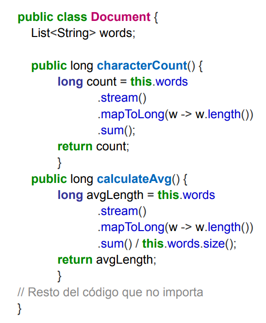

## Ejercicio 8 - Documentos y estadísticas

---

Dado el siguiente código implementado en la clase Document y que calcula algunas estadísticas
del mismo:



1. Enumere los code smell y que refactorings utilizará para solucionarlos.
2. Aplique los refactorings encontrados, mostrando el código refactorizado luego de
   aplicar cada uno.
3. Analice el código original y detecte si existe un problema al calcular las estadísticas.
   Explique cuál es el error y en qué casos se da ¿El error identificado sigue presente
   luego de realizar los refactorings? En caso de que no esté presente, ¿en qué
   momento se resolvió? De acuerdo a lo visto en la teoría, ¿podemos considerar esto
   un refactoring?


1. Code smells encontrados: Temporary Field en ambos métodos -> Inline variable, Duplicate Code -> Extract Method, finalmente se presta a romper la encapsulación por no tener fields private -> Encapsulate Field.
2. 

    Primero el Temporary Field resuelto con Inline Variable:
```java
public class Document {
    List<String> words;
    
    public long characterCount() {
        return this.words
            .stream()
            .mapToLong(w -> w.length())
            .sum();
    }
    
    public long calculateAvg() {
        return this.words
            .stream()
            .mapToLong(w -> w.length())
            .sum() / this.words.size();
    }
}
```
Ahora el Duplicate Code con Extract Method:
```java
public class Document {
    List<String> words;
    
    public long characterCount() {
        return this.words
            .stream()
            .mapToLong(w -> w.length())
            .sum();
    }
    
    public long calculateAvg() {
        return characterCount() / this.words.size();
    }
}
```

Ahora Encapsulate Field para la colección words:

```java
public class Document {
    private List<String> words;
    
    public long characterCount() {
        return this.words
            .stream()
            .mapToLong(w -> w.length())
            .sum();
    }
    
    public long calculateAvg() {
        return characterCount() / this.words.size();
    }
}
```

Agrego personalmente el Replace Lambda with Method Reference para mejorar la legibilidad:
```java
public class Document {
    private List<String> words;
    
    public long characterCount() {
        return this.words
            .stream()
            .mapToLong(String::length)
            .sum();
    }
    
    public long calculateAvg() {
        return characterCount() / this.words.size();
    }
}
```

3. El código original no tenía control de divisor 0. El codigo refactorizado tampoco lo tiene. El comportamiento observable se mantiene exactamente igual, por lo que si hubiese algún handler de la excepción que se lanzaría al ocurrir dicha división, el código funcionaría exactamente de la misma manera.
