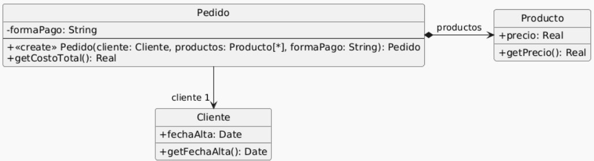
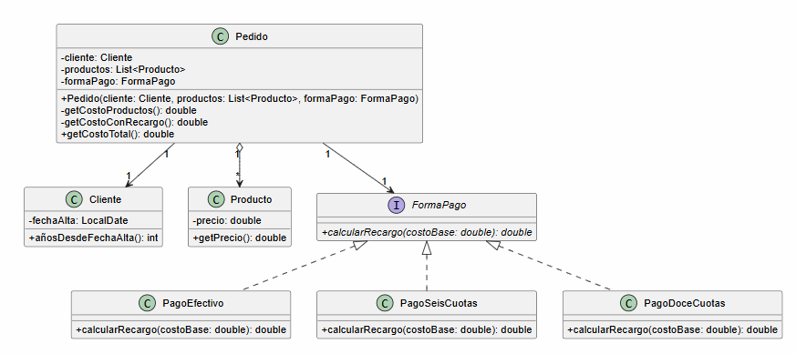

## Ejercicio 9 - Pedidos

---

Se tiene el siguiente modelo de un sistema de pedidos y la correspondiente implementación.



1. Dado el código anterior, aplique únicamente los siguientes refactoring:

   ● Replace Loop with Pipeline (líneas 16 a 19)

   ● Replace Conditional with Polymorphism (líneas 21 a 27)

   ● Extract method y move method (línea 28)

   ● Extract method y replace temp with query (líneas 28 a 33)
2. Realice el diagrama de clases del código refactorizado.

Aplicado Replace Loop with Pipeline se ve así:
```java
import java.time.LocalDate;
import java.time.Period;
import java.util.List;

public class Pedido {
private Cliente cliente;
private List<Producto> productos; // Se agregó el tipo genérico para consistencia
private String formaPago;

    public Pedido(Cliente cliente, List<Producto> productos, String formaPago) {
        if (!"efectivo".equals(formaPago)
                && !"6 cuotas".equals(formaPago)
                && !"12 cuotas".equals(formaPago)) {
            throw new Error("Forma de pago incorrecta");
        }
        this.cliente = cliente;
        this.productos = productos;
        this.formaPago = formaPago;
    }

    public double getCostoTotal() {
        double costoProductos = this.productos.stream()
                .mapToDouble(Producto::getPrecio)
                .sum();
        
        double extraFormaPago = 0;
        if ("efectivo".equals(this.formaPago)) {
            extraFormaPago = 0;
        } else if ("6 cuotas".equals(this.formaPago)) {
            extraFormaPago = costoProductos * 0.2;
        } else if ("12 cuotas".equals(this.formaPago)) {
            extraFormaPago = costoProductos * 0.5;
        }

        int añosDesdeFechaAlta = Period.between(this.cliente.getFechaAlta(), LocalDate.now()).getYears();

        // Aplicar descuento del 10% si el cliente tiene más de 5 años de antigüedad
        if (añosDesdeFechaAlta > 5) {
            return (costoProductos + extraFormaPago) * 0.9;
        }

        return costoProductos + extraFormaPago;
    }
}

class Cliente {
private LocalDate fechaAlta;

    public LocalDate getFechaAlta() {
        return this.fechaAlta;
    }
}

class Producto {
private double precio;

    public double getPrecio() {
        return this.precio;
    }
}
```

Aplicado Replace Conditional with Polymorphism se ve así:

```java
import java.time.LocalDate;
import java.time.Period;
import java.util.List;

public class Pedido {
   private Cliente cliente;
   private List<Producto> productos; // Se agregó el tipo genérico para consistencia
   private FormaPago formaPago;

   public Pedido(Cliente cliente, List<Producto> productos, FormaPago formaPago) {
      this.cliente = cliente;
      this.productos = productos;
      this.formaPago = formaPago;
   }

   public double getCostoTotal() {
      double costoProductos = this.productos.stream()
              .mapToDouble(Producto::getPrecio)
              .sum();

      double extraFormaPago = formaPago.calcularRecargo(costoProductos);

      int añosDesdeFechaAlta = Period.between(this.cliente.getFechaAlta(), LocalDate.now()).getYears();

      // Aplicar descuento del 10% si el cliente tiene más de 5 años de antigüedad
      if (añosDesdeFechaAlta > 5) {
         return (costoProductos + extraFormaPago) * 0.9;
      }

      return costoProductos + extraFormaPago;
   }
}

class Cliente {
   private LocalDate fechaAlta;

   public LocalDate getFechaAlta() {
      return this.fechaAlta;
   }
}

class Producto {
   private double precio;

   public double getPrecio() {
      return this.precio;
   }
}

public interface FormaPago {
   double calcularRecargo(double costoBase);
}

public class PagoEfectivo implements FormaPago {
   @Override
   public double calcularRecargo(double costoBase) {
      return 0;
   }
}

public class PagoSeisCuotas implements FormaPago{ 
    @Override 
    public double calcularRegargo(double costoBase){
        return costoBase * 0.2;
    }
}

public class PagoDoceCuotas implements FormaPago{
   @Override
   public double calcularRegargo(double costoBase){
      return costoBase * 0.5;
   }
}
```

Aplicado el tercer refactor Move y Extract Method de línea 28:

```java
import java.time.LocalDate;
import java.time.Period;
import java.util.List;

public class Pedido {
   private Cliente cliente;
   private List<Producto> productos; // Se agregó el tipo genérico para consistencia
   private FormaPago formaPago;

   public Pedido(Cliente cliente, List<Producto> productos, FormaPago formaPago) {
      this.cliente = cliente;
      this.productos = productos;
      this.formaPago = formaPago;
   }

   public double getCostoTotal() {
      double costoProductos = this.productos.stream()
              .mapToDouble(Producto::getPrecio)
              .sum();

      double extraFormaPago = formaPago.calcularRecargo(costoProductos);
      
      int añosDesdeFechaAlta = cliente.añosDesdeFechaAlta();
      // Aplicar descuento del 10% si el cliente tiene más de 5 años de antigüedad
      if (añosDesdeFechaAlta > 5) {
         return (costoProductos + extraFormaPago) * 0.9;
      }

      return costoProductos + extraFormaPago;
   }
}

class Cliente {
   private LocalDate fechaAlta;

   public int añosDesdeFechaAlta(){
      return Period.between(this.fechaAlta, LocalDate.now()).getYears();
   }
}

class Producto {
   private double precio;

   public double getPrecio() {
      return this.precio;
   }
}

public interface FormaPago {
   double calcularRecargo(double costoBase);
}

public class PagoEfectivo implements FormaPago {
   @Override
   public double calcularRecargo(double costoBase) {
      return 0;
   }
}

public class PagoSeisCuotas implements FormaPago{ 
    @Override 
    public double calcularRegargo(double costoBase){
        return costoBase * 0.2;
    }
}

public class PagoDoceCuotas implements FormaPago{
   @Override
   public double calcularRegargo(double costoBase){
      return costoBase * 0.5;
   }
}
```

Último refactor, Extract Method y Replace Temp with Query:

```java
import java.time.LocalDate;
import java.time.Period;
import java.util.List;

public class Pedido {
   private Cliente cliente;
   private List<Producto> productos; // Se agregó el tipo genérico para consistencia
   private FormaPago formaPago;

   public Pedido(Cliente cliente, List<Producto> productos, FormaPago formaPago) {
      this.cliente = cliente;
      this.productos = productos;
      this.formaPago = formaPago;
   }
   
   private double getCostoProductos(){
       return this.productos.stream()
               .mapToDouble(Producto::getPrecio)
               .sum();
   }
   
   private double getCostoConRecargo(){
       return getCostoProductos() + formaPago.calcularRecargo(getCostoProductos());
   }
   
   public double getCostoTotal() {
      if (cliente.añosDesdeFechaAlta() > 5) return getCostoConRecargo() * 0.9;
      return getCostoConRecargo();
   }
}

class Cliente {
   private LocalDate fechaAlta;

   public int añosDesdeFechaAlta(){
      return Period.between(this.fechaAlta, LocalDate.now()).getYears();
   }
}

class Producto {
   private double precio;

   public double getPrecio() {
      return this.precio;
   }
}

public interface FormaPago {
   double calcularRecargo(double costoBase);
}

public class PagoEfectivo implements FormaPago {
   @Override
   public double calcularRecargo(double costoBase) {
      return 0;
   }
}

public class PagoSeisCuotas implements FormaPago{ 
    @Override 
    public double calcularRegargo(double costoBase){
        return costoBase * 0.2;
    }
}

public class PagoDoceCuotas implements FormaPago{
   @Override
   public double calcularRegargo(double costoBase){
      return costoBase * 0.5;
   }
}
```

3. Diagrama UML final:

